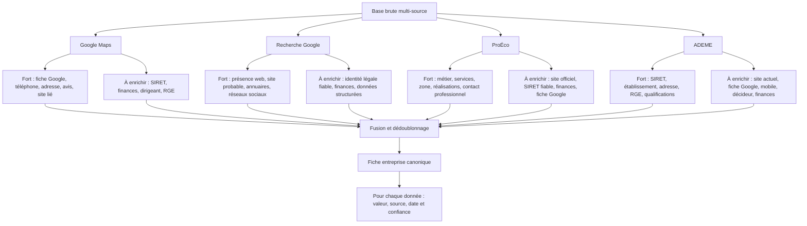
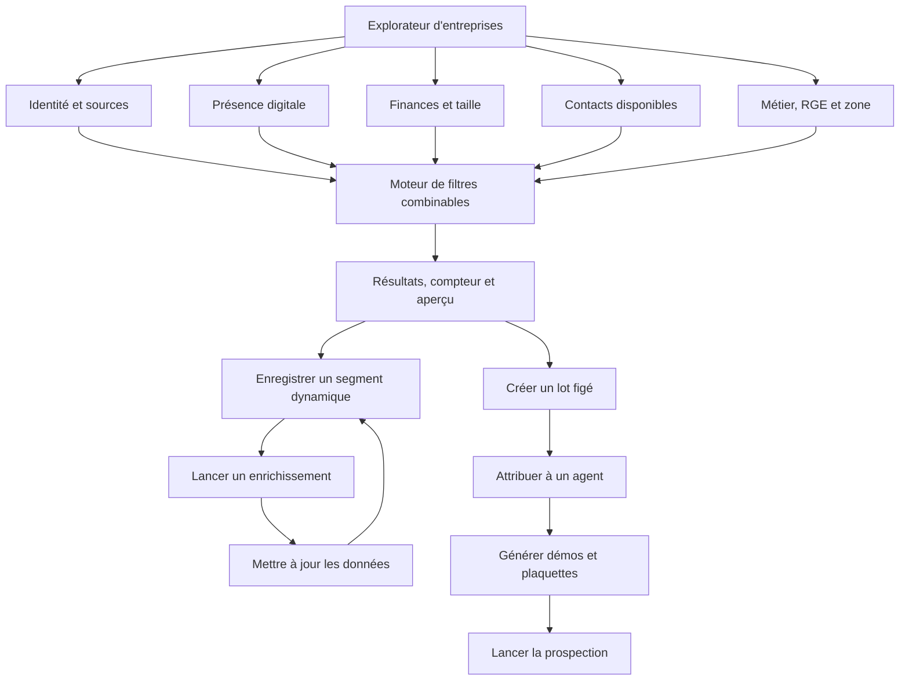
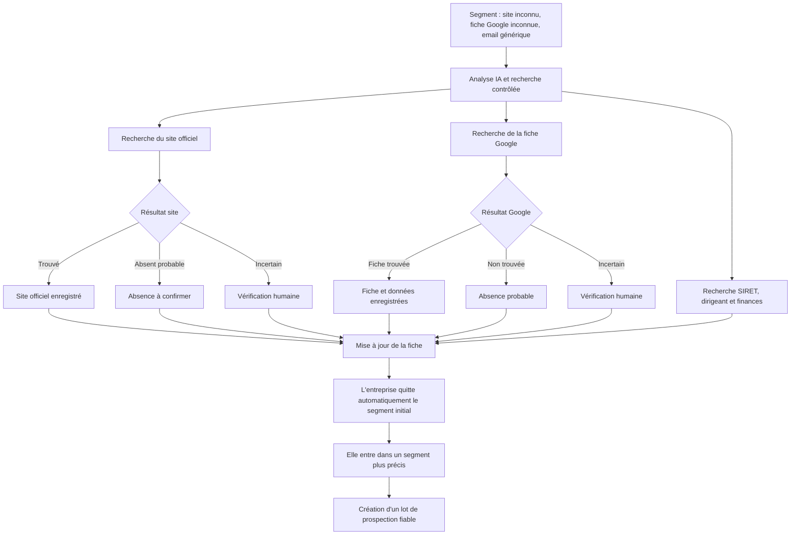
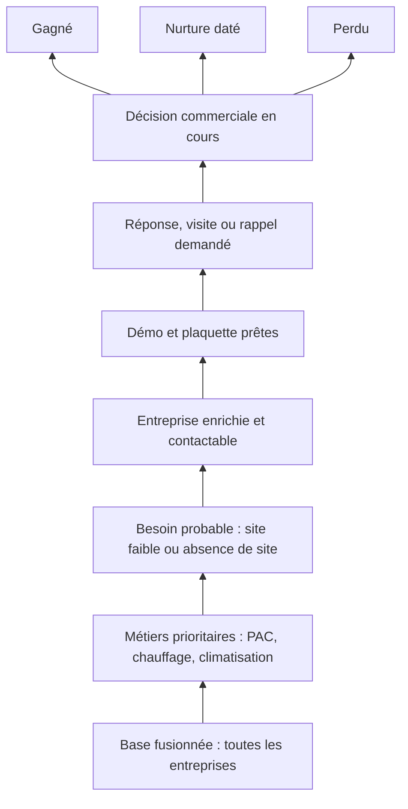
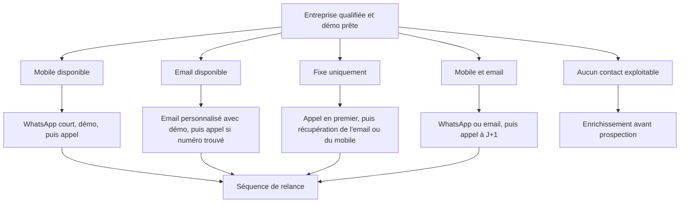
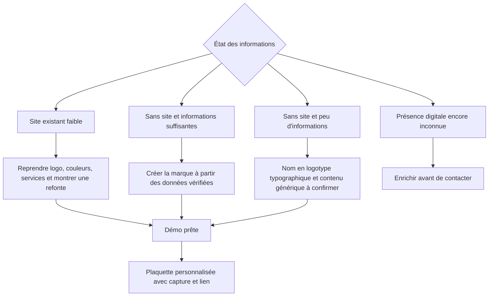
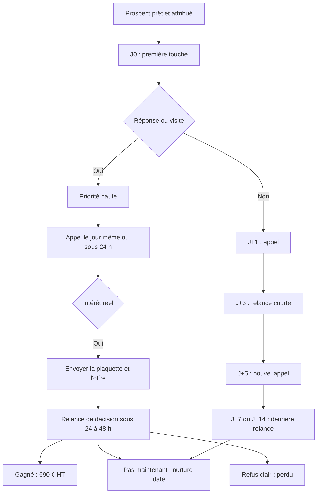
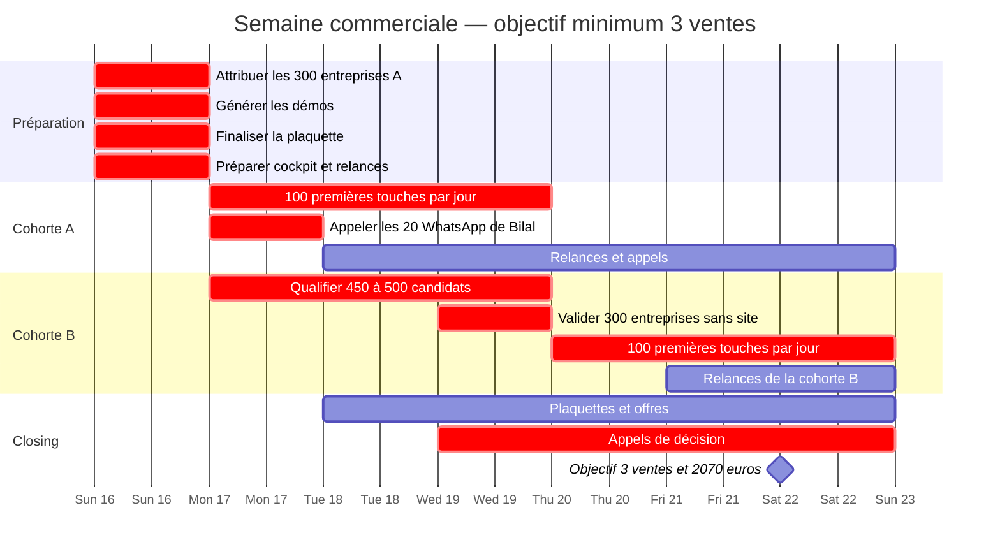
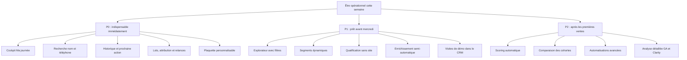
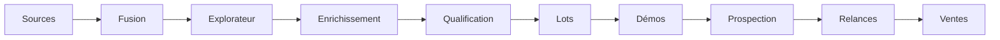

# Vision du CRM — de la base hétérogène aux lots de prospection

> Énoncée par Matteo le 16 août 2026. Ce document est la référence : quand une décision
> d'architecture doit être tranchée, c'est ici qu'on vient chercher l'intention.
> L'état d'avancement mesuré est dans la seconde partie, et il est daté — il vieillit,
> pas la vision.

---

## L'énoncé

Le CRM doit devenir une machine qui transforme une base hétérogène en segments de plus en
plus fiables, puis en lots de prospection avec une méthode adaptée.

### La règle fondamentale

**Un segment est dynamique** : une entreprise en sort automatiquement lorsqu'elle est enrichie.
**Un lot est figé** : il conserve les entreprises sélectionnées pour mesurer la campagne,
même si leurs données évoluent.

---

### 1. Origine des entreprises et informations manquantes

Le dédoublonnage doit utiliser, **dans cet ordre** : SIRET exact ; téléphone normalisé ;
domaine officiel ; nom normalisé + ville ; adresse ; rapprochement manuel pour les cas incertains.

Une entreprise peut provenir de plusieurs sources. **Il ne faut pas choisir une seule source :
il faut fusionner les meilleures informations.**

---

### 2. Tous les filtres de l'explorateur

Page pressentie : `/entreprises/explorer`.

| Famille | Filtres à proposer |
| --- | --- |
| Provenance | ADEME, Google Maps, Google, ProÉco, plusieurs sources, source unique |
| Identité | SIRET vérifié, SIRET inconnu, SIRET ambigu, établissement actif/inactif |
| Métier | PAC, climatisation, chauffage, plomberie, VMC, solaire, isolation, IRVE |
| RGE | qualification connue/inconnue, type de qualification, date d'expiration |
| Site | site officiel connu, absence confirmée, inconnu, URL invalide, annuaire seulement |
| Fiche Google | connue, absence probable, inconnue, fiche trouvée sans site, fiche avec site |
| Téléphone | mobile, fixe, les deux, aucun, numéro valide/invalide |
| Email | présent/absent, valide/invalide, nominatif, professionnel, générique |
| Type d'email | domaine entreprise, Gmail, Outlook, Yahoo, Orange/Wanadoo, adresse de rôle |
| Décideur | dirigeant connu, contact ADEME connu, prénom connu, téléphone direct |
| Finances | CA connu/inconnu, année disponible, fourchette personnalisée |
| Résultat | connu/inconnu, bénéfice, perte, fourchette personnalisée |
| Taille | effectif connu/inconnu, tranche d'effectif, ancienneté |
| Google Maps | note, nombre d'avis, activité récente, photos, horaires |
| Qualification IA | à analyser, qualifiée, disqualifiée, incertaine, vérification humaine |
| Démo | non générée, prête, publiée, envoyée, visitée, plusieurs visites |
| Plaquette | non générée, prête, envoyée |
| Prospection | jamais contactée, contactée, réponse, relance due, en retard |
| Attribution | Matteo, Bilal, nouvel agent, non attribuée |
| Campagne | site faible, sans site, campagne libre, nurture |
| Qualité des données | score de complétude, champs critiques manquants, confiance globale |

Les fourchettes financières restent **configurables** : CA inconnu ; < 100 k€ ;
100–300 k€ ; 300 k€–1 M€ ; > 1 M€.

> Un Gmail n'est pas forcément un mauvais contact : cela peut être l'adresse personnelle
> du gérant. **Il faut séparer `type_email` de `qualité_email`.**

---

### 3. Fonctionnement de la page interactive

Disposition : filtres à gauche, entreprises au centre, fiche complète en panneau droit,
filtres actifs et compteur en haut, barre d'action (enrichir, créer un lot, attribuer,
générer les démos).

Vues à pouvoir sauvegarder :
- Sans site connu + fiche Google inconnue
- PAC + mobile + email + aucun site
- Site faible + CA supérieur à 300 k€
- Sans site confirmé + mobile disponible
- Démo visitée + aucun appel
- Plaquette envoyée + décision en attente

---

### 4. La boucle d'enrichissement dynamique

**Les statuts importants doivent avoir trois états, pas seulement oui/non :**
connu présent ; **absence confirmée** ; inconnu.

Il faut également conserver : la source de la conclusion ; la date de vérification ;
le niveau de confiance ; l'URL ou la preuve ; la nécessité éventuelle d'une vérification humaine.

---

### 5. La pyramide de qualification

Ordre de priorité quotidien :
1. Rappel demandé à une heure précise
2. Prospect ayant répondu
3. Démo visitée récemment
4. Plusieurs visites
5. Plaquette envoyée et décision attendue
6. Démo envoyée, mais pas encore d'appel
7. Première touche à effectuer
8. Entreprise à enrichir

---

### 6. Méthode de contact selon les données disponibles

Pas besoin de forcer tous les canaux : mobile + email → meilleur premier canal puis appel ;
mobile seul → WhatsApp prudent puis appel ; fixe + email → email puis appel ;
fixe seul → appel en premier ; email seul → email personnalisé, relance limitée ;
**aucun contact → enrichir, ne pas perdre du temps à générer immédiatement tout le matériel.**

---

### 7. Adaptation de la démo aux informations disponibles

Sans logo : nom dans une belle typographie, palette propre et cohérente, **pas de faux logo
complexe présenté comme définitif**, mention discrète que l'identité est une proposition.

Services : utiliser tous les services vérifiés, compléter avec les services typiques de la
catégorie, **ne jamais inventer une qualification RGE ou une certification**, présenter le
contenu comme une proposition à valider.

---

### 8. Séquence commerciale de la semaine

**On ne relance pas « jusqu'à obtenir une réponse » sans limite.** Chaque prospect termine
dans l'un de ces états : prochaine action datée ; décision attendue ; nurture ; gagné ; perdu.

---

### 9. Planning de la semaine — objectif minimum 3 ventes

Pour obtenir 300 entreprises réellement sans site, viser 450 à 500 candidates : certaines
auront finalement un site non lié à Google, une page sous un autre nom, une fiche Google
difficile à retrouver, une activité différente, ou des informations trop incertaines.
Cible opérationnelle à ajuster dès que le vrai taux de rejet est connu.

---

### 10. Les pages et éléments à terminer

La plaquette de cette semaine reste simple : même structure pour toutes les entreprises ;
logo ou nom typographique ; capture personnalisée de la démo ; 690 € HT ; délai de 48 à 72 h ;
deux séries de modifications ; hébergement à 29 €/mois ; lien cliquable vers la démo.

### Le système complet

**Priorité absolue : cockpit, attribution, historique, prochaine action et plaquette.**
L'explorateur et l'enrichissement doivent ensuite produire les 300 entreprises sans site
pour jeudi.

---
---

## Avancement mesuré — 16 août 2026

> Méthode : les 87 briques ci-dessus confrontées une par une au dépôt **et** à la base de
> production, par huit audits parallèles, puis une passe qui a tenté de **contredire** les
> 27 briques déclarées absentes — 27 verdicts sur 27 ont été relevés, dont sept de plus de
> 40 points. Une brique ne compte pour « faite » que si quelqu'un peut s'en servir
> aujourd'hui sans écrire de SQL. Chiffre à refaire, pas à recopier : il vieillit.

### **44 %** au global, moyenne à plat sur 87 briques

| Domaine | Avancement |
| --- | --- |
| Démos adaptées, plaquettes, retour des visites | 59 % |
| Entonnoir, pertes par étage, cohortes, scoring | 58 % |
| Choix du canal, séquences, relances bornées | 58 % |
| Cockpit, recherche, historique, prochaine action | 51 % |
| Segments dynamiques et lots figés | 48 % |
| Boucle d'enrichissement et statuts à trois états | 37 % |
| Sources, fusion, dédoublonnage, traçabilité | 36 % |
| Explorateur et ses 21 familles de filtres | 31 % |

### L'inversion à retenir

Rangés selon la priorité que la vision se donne elle-même (§10), les trois paquets
tombent dans le **désordre** :

- **P0** (« indispensable immédiatement ») ≈ **55 %** — la recherche par nom et par
  téléphone est finie (90 %), le cockpit et l'historique tiennent, la plaquette non ;
- **P1** (« prêt avant mercredi ») ≈ **35 %** — c'est le paquet le **moins** avancé ;
- **P2** (« après les premières ventes ») ≈ **58 %** — c'est le paquet le **plus** avancé.

L'entonnoir et la comparaison des cohortes, classés « plus tard », sont la partie la mieux
finie de toute la vision. L'explorateur et les segments, dus mercredi, sont la moins finie.

### Ce qui est déjà construit et que personne n'appelle

- **`chercher_entreprises(p_recherche, p_flags, p_sources, p_limite, p_offset)`** — déployée
  en production. Cherche par nom, ville, code postal, SIRET, SIREN, e-mail, domaine d'hôte
  et téléphone normalisé, rend le total exact, et porte déjà les drapeaux de la vision
  (`sans_site`, `sans_google`, `sans_siret`, `qualite`). La moitié du dos de l'explorateur
  existe. Aucun appelant.
- **`fusionner_entreprises(...)` + `doublons_suggeres(...)`** — ~450 lignes, dry-run réel
  (écrit puis se défait par un SQLSTATE maison pour rendre un vrai rapport de conflits),
  archive avant écriture, repointage des 41 clés étrangères **lues dans le catalogue**.
  `archive_fusion_entreprises` : 0 ligne. Jamais exécutée. Aucun appelant.
  Stock en attente : 1 362 fiches en doublon de téléphone, 1 574 de domaine.
- **Le statut à trois états est déjà écrit — sur un champ.** `src/lib/donnees-publiques/rge-compteur.ts`
  nomme le piège exactement (« l'ADEME dit 0 → absence VÉRIFIÉE / on n'a pas regardé →
  IGNORANCE ») et cite l'incident qui l'a motivé. Même chose sur le site web
  (`entreprises_audit_site.injoignable` : 314 lignes, `bloque`). Le modèle est à
  généraliser, pas à inventer.

### Les quatre mesures qui font mentir la semaine

Vérifiées en base le 16/08 :

1. **`plaquette_token` : 0 sur 42 lignes.** Colonnes, fonctions et route de lot déployées ;
   aucun écran ne montre le lien par prospect. La cohorte B, sans site donc invisible de
   GA4, n'a alors **aucune** source pour l'étage « document ouvert » — et comme GA4 est
   configuré, l'étage affichera 0 en se présentant comme mesuré.
2. **`opportunite_etapes_journal` : 0 transition sur 883 lignes.** Le déclencheur marche
   (vérifié par sonde le 16/08), mais 883/883 sont des créations, dont 520 datées du jour
   de l'import. Tant qu'aucune carte ne bouge, l'entonnoir lira zéro au-delà d'« attribuée ».
3. **Les 600 fiches appartiennent toutes à `ilvainterieurs@gmail.com`.** `codingmos@gmail.com`
   en possède 0, et la route de l'entonnoir filtre `owner_id = user.id` sans dérogation
   admin : ouvert avec le mauvais compte, l'écran affiche « A 0 · B 0 » sans un mot.
4. **La 4e séquence a une étape au message vide.** En base, `0e7a1f20-…-0004` porte 5 étapes
   (le fichier SQL en décrit 3) et l'étape `s4` — branche « sans réponse », celle que
   prennent la majorité des prospects — n'a ni `template` ni `message`. Elle est en `draft` :
   rien n'est parti, l'activer telle quelle poserait des tâches WhatsApp vides.

### L'ordre de construction qui découle de la mesure

1. **Le tri-état et la provenance par champ** — 12 % aujourd'hui, et six familles de filtres
   de l'explorateur *sont* le tri-état. Un filtre ne peut pas exposer « inconnu » avant que
   la colonne sache le dire.
2. **L'explorateur** — moins cher que prévu : le dos existe (`chercher_entreprises`), il
   manque la façade et le branchement.
3. **Les segments, puis les lots** — un segment est une requête nommée, un lot en est la
   photo. Le lot existe déjà en creux (`cohorte_demarchage` + `archive_cohortes_20260816`) ;
   le segment n'existe nulle part.
4. **La table d'arbitrage par champ**, absente de la vision et nécessaire à la fusion
   automatique : l'ADEME prime sur le site pour le RGE, l'adresse prime sur le nom pour le
   rapprochement, le chiffre le plus bas gagne pour les finances. Ces règles existent, mais
   dans des notes — pas dans le code. Et elles s'arbitrent **par champ**, pas par source :
   ProÉco gagne sur les services et perd sur le SIRET.
